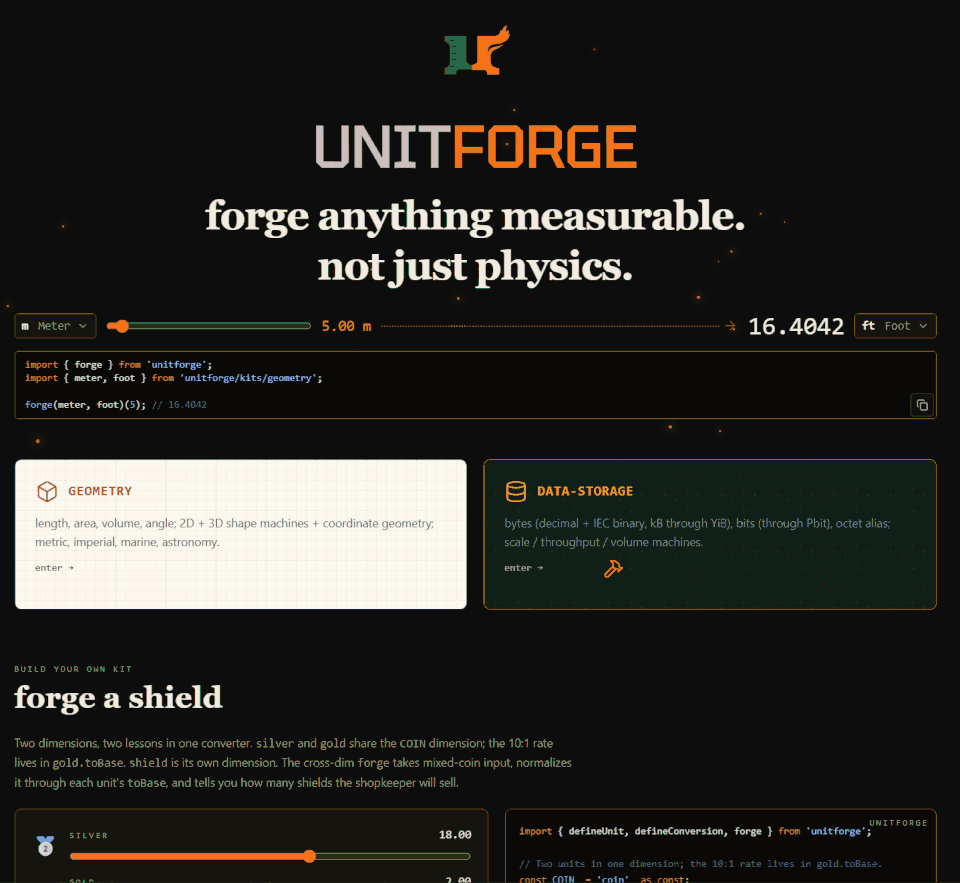

<p align="center">
  
</p>

<p align="center">
  <a href="https://simiancraft.github.io/unitforge/">
    
  </a>
</p>

<p align="center">
  <a href="https://simiancraft.github.io/unitforge/">
    
  </a>
</p>

[](https://www.npmjs.com/package/unitforge)
[](https://www.npmjs.com/package/unitforge)
[](https://github.com/simiancraft/unitforge/actions/workflows/ci.yml)
[](https://codecov.io/github/simiancraft/unitforge)
[](#tree-shaking)
[](https://securityscorecards.dev/viewer/?uri=github.com/simiancraft/unitforge)
[](./LICENSE)

# unitforge

**One Coke ≈ 9.75 sugar cubes.** A type-safe unit conversion library for TypeScript: units of measure for any domain, cross-dimensional conversion, and dimension mismatches caught at compile time. Three primitives (`defineUnit`, `defineConversion`, `forge`) work against any unit and any dimension you import or invent.

## Kits

**Have you ever wanted to:**

- Convert from ångströms to gigaparsecs without dropping a factor of 1e6 somewhere?
- Scale a recipe from a US cup (236.6 mL) to a UK cup (284.1 mL) and not ruin the dish?
- Ship Egyptian royal cubits and Roman pedes in a classics-translation tool?
- Quote the Hubble constant in km/s/Mpc and have the type system catch the dimension mismatch when you cross it with anything else?
- Explain to a confused user why their 1 TB drive shows up as 931 GB?
- Define a `'sugar'` dimension in four lines and convert Coke cans to sugar cubes?

The kits below cover all of those. The API is composable: a unit from one kit converts cleanly against a unit from another because every cross-kit re-export resolves to the same `Unit` instance. Build your own for anything else (game state, lab assays, factions, the in-universe currency of your favorite RPG).

**Domain kits** (each link runs live against the built package):

- [**`geometry`**](https://simiancraft.github.io/unitforge/#/geometry): shape math; 40+ derivations (rectangle, triangle, ellipse, annulus, sphere, cylinder, polar↔cartesian, sector, segment) over LENGTH + VOLUME + AREA + ANGLE.
- [**`cooking`**](https://simiancraft.github.io/unitforge/#/cooking): recipe scaling across US/UK/metric cup variants; cooking-tradition packaging (stick of butter, EU butter block, dash, pinch); heat descriptors. Demo includes the soda-vs-sugar comparator.
- [**`data-storage`**](https://simiancraft.github.io/unitforge/#/data-storage): bytes (decimal and IEC binary), bits; the GB-vs-GiB and Gbit-vs-MB confusion you keep explaining.
- [**`astronomy`**](https://simiancraft.github.io/unitforge/#/astronomy): solar-system to cosmological distance (au, ly, pc, kpc/Mpc/Gpc, light-second through light-hour) per IAU 2012 / 2015 resolutions. Demo flies you through a live BabylonJS solar system, then turns H0 into the age of the universe, distances into light-travel time, interstellar trips into generations of tortoises, and the Sun into a grain of sand.
- [**`antiquity`**](https://simiancraft.github.io/unitforge/#/antiquity): ~90 atoms across 8 civilizations (Egyptian, Mesopotamian, Greek, Roman, Hebrew, Chinese, Japanese, and pre-1835 English). Classics translation, numismatic mass, archaeological analysis. Not for clinical or commercial use; reach for it when you're reading Herodotus. Demo includes the rulers-of-empire length comparator, the coin scale, and a "how tall is your CEO?" height comparator that reads a modern height back in ancient cubits.

**Atomic building blocks** (use directly when no domain kit fits, or compose your own kit on top):

- **`length`**: SI + customary + nautical (nmi) + crystallographic (Å).
- **`volume`**: SI cubic + liter family + cubic imperial + gallon/quart/pint/fl-oz US+UK + spoons + every cup variant a cookbook author has named.
- [**`mass`**](https://simiancraft.github.io/unitforge/#/mass): SI + US customary + Asian regional (jin PRC 500 g, jin HK 600 g, Singapore catty 604.79 g). Demo includes the three-jins regional comparator and a real-things mass anchor across 12 orders of magnitude.
- [**`temperature`**](https://simiancraft.github.io/unitforge/#/temperature): Kelvin + Celsius + Fahrenheit + Rankine. Demo includes the value-vs-delta machine (10 °F is -12.22 °C as a value, +5.56 °C as a delta) and thermal landmarks from absolute zero to the Sun's photosphere.

## Quick start

```ts
import { defineUnit, forge } from 'unitforge';

// Custom dimension in four lines; no kit required.
const cokeCan   = defineUnit({ id: 'coke-can',   dimension: 'sugar', toBase: (n) => n * 39, fromBase: (g) => g / 39 });
const sugarCube = defineUnit({ id: 'sugar-cube', dimension: 'sugar', toBase: (n) => n * 4,  fromBase: (g) => g / 4  });

forge(cokeCan, sugarCube)(1); // ≈ 9.75; one 12 oz Coke equals 9.75 sugar cubes
```

```ts
import { forge } from 'unitforge';
import { meter, foot } from 'unitforge/kits/geometry';

forge(meter, foot)(5); // ≈ 16.4042
```

```ts
import { forge } from 'unitforge';
import { gigabyte, gibibyte } from 'unitforge/kits/data-storage';

forge(gigabyte, gibibyte)(500); // ≈ 465.66; the 500 GB drive Windows reports as 465 GB
```

```ts
import { forge } from 'unitforge';
import { meter } from 'unitforge/kits/geometry';
import { gigabyte } from 'unitforge/kits/data-storage';

// @ts-expect-error: meter is length, gigabyte is data; mismatch caught at compile time.
forge(meter, gigabyte)(5);
```

## Install

```sh
bun add unitforge
pnpm add unitforge
yarn add unitforge
npm install unitforge
```

Requires Node 22+, ESM-only (`"type": "module"`), TypeScript `moduleResolution: "node16" | "nodenext" | "bundler"`.

## Scope

Library only. ESM only. Node 22+. No CJS build; no peer dependencies. Three primitives, not three hundred kits.

## vs. `convert-units`

`convert-units` is the incumbent ([over 100k weekly downloads](https://www.npmjs.com/package/convert-units)); same problem space, different philosophy. unitforge catches dimension mismatches at compile time and ships cross-dimensional recipes; `convert-units` does neither, today or in `3.x`.

| | `convert-units` 2.3.4 | `convert-units` 3.0.0-beta | **unitforge** |
| --- | --- | --- | --- |
| Module format | CJS | ESM + CJS + UMD | **ESM only** |
| Bundled TypeScript types | ❌ (via `@types/convert-units`) | ✅ | **✅** |
| Custom measures / dimensions | ✅ `customMeasure` | ✅ `customMeasure` | **✅ `defineUnit`** |
| Cross-dimensional conversions (one Coke ≈ N donuts of sugar) | ❌ | ❌ | **✅ `defineConversion`** |
| Dimension mismatch caught at | runtime | runtime | **compile time** (`NoInfer` on the `to` side) |
| Tree-shaking model | barrel; pass measures to `configureMeasurements` | same | **per-export subpath** (`unitforge/kits/<name>`) |

<sub>Table compares the installed `convert-units@2.3.4` (CJS-only, 2018) and the in-development `3.0.0-beta`.</sub>

## Tree-shaking

Atomic by design: your import graph is the runtime graph. Every unit and conversion is an independent named export annotated `/*#__PURE__*/`; each spec inlines its math, with no global registry and no lookup table to drag in.

Production bundles pay only for what you actually import. Measured with `esbuild --bundle --minify --tree-shaking=true`:

| Import | min | gzip |
| --- | --- | --- |
| `import { meter } from 'unitforge/kits/geometry'` | 347 B | **278 B** |
| `import { forge } + meter, centimeter` (within-dim) | 3.9 kB | **1.7 kB** |
| `import { forge } + cross-dim conversion` (forge + 3 kit values) | 4.2 kB | **1.9 kB** |
| `import * as g from 'unitforge/kits/geometry'` + everything from main barrel | 7.4 kB | **2.7 kB** |
| `import { VERSION } from 'unitforge/version'` (opt-in, inlines `package.json`) | 2.2 kB | **1.0 kB** |

**Tarball:** ≈ 118 kB packed / ≈ 490 kB unpacked / 72 files (`npm pack`); you pay for what you import, not what's on disk.

## Build your own

Three primitives. Here's each one. The integrated version is the [ArPeeGee shop](https://simiancraft.github.io/unitforge/) demo on the live site (RPG shop with coins, goods, and a coins-to-shields forge).

### 1. `defineUnit`

Declare a unit value in any dimension you want.

```ts
import { defineUnit } from 'unitforge';

const handspan = defineUnit({
  id: 'handspan',
  label: 'Handspan',
  symbol: 'hsp',
  dimension: 'length',
  toBase: (v) => v * 0.235,
  fromBase: (b) => b / 0.235,
});
```

### 2. `defineConversion`

Cross-dimensional recipes; inputs in, output out. Per-property validators run on one input at a time; the optional `_all` validator runs on the destructured object and is the only place to enforce relationships between inputs (e.g., the triangle inequality).

```ts
import { defineConversion } from 'unitforge';

const triangleAreaFromSides = defineConversion({
  inputs: { a: 'length', b: 'length', c: 'length' },
  output: 'area',
  validate: {
    a: (v) => v > 0 || 'a must be positive',
    b: (v) => v > 0 || 'b must be positive',
    c: (v) => v > 0 || 'c must be positive',
    _all: ({ a, b, c }) =>
      (a + b > c && b + c > a && a + c > b) || 'sides violate the triangle inequality',
  },
  compute: ({ a, b, c }) => {
    const s = (a + b + c) / 2; // Heron's
    return Math.sqrt(s * (s - a) * (s - b) * (s - c));
  },
});
```

The `output` field can also be an object so one forge returns multiple values; the shipped `cartesianFromPolar` (`{ radius: 'length', angle: 'angle' } → { x: 'length', y: 'length' }`) is the canonical example.

### 3. `forge`

The converter is born. Forge it once; call it forever.

```ts
import { forge } from 'unitforge';
import { foot, squareFoot, areaFromRectangleLengthAndWidth } from 'unitforge/kits/geometry';

// Within-dimension: handspan from above to foot.
const inFeet = forge(handspan, foot);
inFeet(12);  // ≈ 9.252

// Cross-dimensional: two handspans piped through the kit's rectangle conversion.
const inSqFt = forge(
  { length: handspan, width: handspan },
  squareFoot,
  { via: areaFromRectangleLengthAndWidth },
);
inSqFt({ length: 12, width: 8 });  // ≈ 57.066
```

See all three composed: the [ArPeeGee shop demo](https://simiancraft.github.io/unitforge/) runs two coin units in one dimension, a goods dimension, and one cross-dim forge from coins to shields. Same primitives, live.

For multiplicative units (handspans, pints, miles), the exported `linear(scale)` helper builds the `{ toBase, fromBase }` pair so you can spread it in: `defineUnit({ ...spec, ...linear(0.235) })`. Userland convenience only; kit-shipped units inline closures (the spread defeats per-export tree-shake).

## API

Three primitives. One consumer (`forge`); two factories (`defineUnit`, `defineConversion`). Full type signatures live in `dist/index.d.ts`.

### `forge(from, to, config?)`

Returns a converter function. Within-dimension forges take a scalar and return a scalar; cross-dimensional forges take an object input and require `via:` in the config. `NoInfer<D>` on the `to` side makes wrong-dimension calls a compile error.

**Config options** (same name = same effect across overloads):

| Option | Type | Effect |
| --- | --- | --- |
| `via` | `Conversion<I, O, T>` | **Required** for cross-dim. Carries the input shape, validator map, and `compute`. |
| `validate` | `ValidatorMap<I, T>` | Call-site validators, additive on top of the conversion's own. |
| `precision` | `number` | Rounds output and cache key to this many decimal places. |
| `memoize` | `number` | FIFO bounded cache. `0` or absent = off. Default cap `1024`; max `1_048_576`. |

### `defineUnit(spec)`

A unit value: `id`, `label`, `symbol`, `dimension`, `toBase`/`fromBase`, optional `base: true`. See [Build your own](#build-your-own).

### `defineConversion(spec)`

A conversion value: input shape (field name to dimension), output (single dimension or record), optional validators, a `compute` function in base units. Inputs normalize before `compute`; outputs denormalize after. Pipeline details and validator contract: see [`llms.txt`](./llms.txt).

## Types

Re-exported types from the root barrel: `Unit`, `Conversion`, `Dimension`, `ForgeInput`, `ForgeOutput`, `UnitMap`, `ValidatorMap`, `ValidationFailure`. Re-exported runtime values: `linear` (the helper), `ValidationError` (thrown when validators fail; aggregates a `ValidationFailure[]`), `DEFAULT_MEMO_CAP` (`1024`), `MEMO_CAP_MAX` (`1_048_576`). Full type surface in [`llms.txt`](./llms.txt).

## Development

```sh
bun install && bun run check
```

See [CONTRIBUTING.md](./CONTRIBUTING.md) for the full per-task command table.

## Testing

Three layers, all gated on every CI build:

- **Unit tests** (`bun test`): 770+ tests; **100.00% line coverage**. Tracked via Codecov.
- **Property-based fuzz** via [fast-check](https://github.com/dubzzz/fast-check) in `test/fuzz/`. Also satisfies the [OpenSSF Scorecard](https://github.com/ossf/scorecard) Fuzzing check.
- **Mutation testing** via [Stryker](https://stryker-mutator.io/) (`bun run mutation`): **96.36%** score; CI break threshold 75%.

Per-file mutation breakdown and survivor-classification policy: see [`llms.txt`](./llms.txt).

## Community

- Bugs and feature requests: [GitHub issues](https://github.com/simiancraft/unitforge/issues)
- Security: [private vulnerability reporting](https://github.com/simiancraft/unitforge/security/advisories/new); see [SECURITY.md](./SECURITY.md)
- Code of conduct: [CODE_OF_CONDUCT.md](./CODE_OF_CONDUCT.md)

## Extending

Adding a kit: see [EXTENDING.md](./EXTENDING.md).

## For LLMs and agents

Feeding this repo into Claude / Cursor / Copilot? Read [`llms.txt`](./llms.txt) first. Same scope as this README in a denser, more parseable shape.

## License

MIT © [the-simian](https://github.com/the-simian). See [LICENSE](./LICENSE) and [NOTICE.md](./NOTICE.md).

<p align="center"><sub>Crafted with care by <a href="https://simiancraft.com">Simiancraft</a>.</sub></p>
